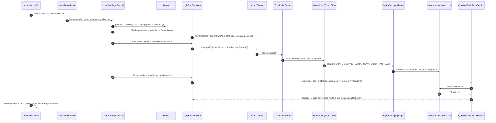

# Clase 2 · Screenplay con Serenity BDD y Cucumber (Web)

Semillero QA 2026 · Módulo Automatización Web (QA Técnico) · Profesor: Diego Zapata — Equipo Transversal QS

> [← Volver al índice del módulo (rama `main`)](../../tree/main)

| Clase | Entrega de la actividad | Retroalimentación |
|---|---|---|
| Miércoles 23 de septiembre de 2026 · 9:00 a.m. – 12:00 m. (8:00–9:00 retro de la actividad 1) | **Viernes 25 de septiembre de 2026, 8:00 a.m.** | Viernes 25 de septiembre de 2026, 8:00 – 9:00 a.m. |

## Objetivo

Construir y entender un proyecto de automatización web **real y funcionando** con
**Serenity BDD + Screenplay + Cucumber + Selenium WebDriver**, organizado en capas, que prueba
la tienda de demostración [Sauce Demo](https://www.saucedemo.com): inicio de sesión, usuario
bloqueado, carrito, compra completa y ordenamiento del catálogo.

Al terminar la clase podrás explicar qué hace cada capa, recorrer una ejecución desde el
archivo `.feature` hasta el navegador y agregar un escenario nuevo respetando la arquitectura.

## Temas

1. Frameworks de automatización: Selenium WebDriver y Serenity BDD.
2. BDD y Gherkin en español (Característica, Antecedentes, Escenario, Dado/Cuando/Entonces, tags).
3. Patrón Screenplay: Actor, Habilidad, Task, Interaction, Question.
4. Capas de la arquitectura de automatización y regla de dependencia entre ellas.
5. POO aplicada (clase 1): encapsulamiento en `models`, herencia en `exceptions`,
   polimorfismo con las interfaces `Task`, `Interaction` y `Question`.

## Requisitos

| Herramienta | Versión | Cómo comprobarlo |
|---|---|---|
| JDK | 17 o superior (probado con 21) | `java -version` |
| Maven | 3.9 o superior (probado con 3.9.16) | `mvn -v` |
| Google Chrome | última estable (probado con Chrome 153) | `chrome://settings/help` |
| IDE | IntelliJ IDEA Community + plugins *Cucumber for Java* y *Gherkin* | — |
| Internet | Necesaria: Maven descarga librerías y las pruebas abren saucedemo.com | — |

No hay que descargar `chromedriver` a mano: Selenium Manager (incluido en Selenium) descarga
el driver compatible con tu Chrome la primera vez.

### Versiones que usa el proyecto

| Librería / plugin | Versión |
|---|---|
| Serenity BDD (`serenity-core`, `serenity-screenplay`, `serenity-screenplay-webdriver`, `serenity-cucumber`, `serenity-maven-plugin`) | 5.3.11 |
| Cucumber (`cucumber-junit-platform-engine`) | 7.34.2 (la misma que usa Serenity 5.3.11) |
| JUnit Platform (`junit-bom`, `junit-platform-suite`) | 6.0.3 |
| Selenium (traído por Serenity) | 4.46.0 |
| Java (`maven.compiler.release`) | 17 |

## Cómo se ejecuta

Todos los comandos se ejecutan en la carpeta raíz del proyecto (donde está `pom.xml`).

```bash
# 1. Cambiarse a la rama de la clase
git switch 02-screenplay-serenity-cucumber-web

# 2. Ejecutar TODOS los escenarios viendo el navegador (modo por defecto, ideal en clase)
mvn clean verify

# 3. Ejecutar todos los escenarios SIN ver el navegador (modo headless, más rápido)
mvn clean verify -Dheadless.mode=true

# 4. Ejecutar solo los escenarios con un tag
mvn clean verify -Dcucumber.filter.tags="@login"

# 5. Combinar tags con and / or / not
mvn clean verify -Dcucumber.filter.tags="@compra and not @carrito"

# 6. Ejecutar un solo escenario por su tag y en modo headless
mvn clean verify -Dheadless.mode=true -Dcucumber.filter.tags="@loginExitoso"
```

Tags disponibles:

| Tag | Qué ejecuta |
|---|---|
| `@regresion` | Todos los escenarios (5) |
| `@login` | Login exitoso y usuario bloqueado (2) |
| `@loginExitoso` · `@usuarioBloqueado` | Un escenario de login |
| `@compra` | Agregar al carrito y compra completa (2) |
| `@carrito` · `@compraExitosa` | Un escenario de compra |
| `@ordenamiento` | Ordenar productos por precio (1) |

Salida esperada al final de `mvn clean verify -Dheadless.mode=true`:

```
[INFO] Tests run: 5, Failures: 0, Errors: 0, Skipped: 0
[INFO]   - Results: 5 tests | 5 passed | 0 failed | 0 errors | 0 compromised | 0 pending | 0 aborted
[INFO] BUILD SUCCESS
```

Con un filtro por tag, Maven cuenta los escenarios no seleccionados como `Skipped`
(por ejemplo `Tests run: 5, Failures: 0, Errors: 0, Skipped: 3` con `@login`). Es normal:
el resumen de Serenity (`Results: 2 tests | 2 passed`) muestra solo los que sí se ejecutaron.

> **Navegador:** este proyecto está configurado y probado solo con **Google Chrome**.
> Microsoft Edge se intentó con Serenity 5.3.11 y falló al crear el driver o al generar el
> reporte, por eso no se incluye.

## Dónde ver el reporte

Después de `mvn clean verify`, abre en el navegador:

```
target/site/serenity/index.html
```

El reporte muestra el porcentaje de escenarios exitosos, cada característica y escenario, los
pasos de Screenplay que ejecutó el actor (por ejemplo *"Carlos inicia sesión con el usuario
standard_user"*) y **una captura de pantalla por paso** (`take.screenshots = AFTER_EACH_STEP`).
El reporte se genera aunque haya escenarios fallidos: por eso las pruebas corren con Failsafe
y el reporte en la fase `post-integration-test`, antes de `verify`.

## Cómo funciona

### El patrón Screenplay en una frase

Un **Actor** (Carlos) tiene **Habilidades** (navegar la web), realiza **Tasks** (iniciar
sesión) que se componen de **Interactions** (escribir, hacer clic, abrir una página) sobre
elementos de la **interfaz** (`Target`), y responde **Questions** (¿qué título ves?) para
validar el resultado.

| Elemento | Qué es | Ejemplo en este proyecto |
|---|---|---|
| Actor | Quien usa el sistema | `theActorCalled("Carlos")` en `LoginStepDefinitions` |
| Habilidad (Ability) | Lo que el actor *puede* hacer | `BrowseTheWeb`, la entrega `OnlineCast` en `Hooks` |
| Task | Objetivo de negocio | `IniciarSesion.conCredenciales(usuario)` |
| Interaction | Acción técnica pequeña | `AbrirPagina`, `EsperarVisible`, `SeleccionarOrdenamiento`, `Click`, `Enter` |
| Target | Localizador de un elemento | `PaginaDeLogin.CAMPO_USUARIO` |
| Question | Consulta del estado de la pantalla | `TituloDeLaSeccion.visible()` |
| Exception | Mensaje claro cuando la validación falla | `ErrorEnInicioDeSesion.NO_INGRESO_A_PRODUCTOS` |

### Recorrido de una ejecución (escenario "Inicio de sesión exitoso")



### Validaciones con excepciones propias

```java
theActorInTheSpotlight().should(
        seeThat(TituloDeLaSeccion.visible(), equalTo(tituloEsperado))
                .orComplainWith(ErrorEnInicioDeSesion.class,
                        ErrorEnInicioDeSesion.NO_INGRESO_A_PRODUCTOS)
);
```

Si el título no coincide, la consola y el reporte muestran nuestro mensaje en español seguido
del detalle de la comparación, por ejemplo:

```
El usuario no ingresó a la sección de productos después de iniciar sesión -
Expected: "Productos"
     but: was "Products"
```

## Arquitectura de carpetas

```
02-screenplay-serenity-cucumber-web/
├── pom.xml                                  ← dependencias y plugins (Failsafe + reporte Serenity)
├── README.md
├── material-de-apoyo/                       ← guía de estudio, presentación y actividad
└── src/
    ├── main/java/co/com/semillero/certificacion/saucedemo/
    │   ├── userinterfaces/   ← DÓNDE están los elementos (Target): PaginaDeLogin, PaginaDeInventario,
    │   │                        PaginaDelCarrito, PaginaDeCheckout
    │   ├── interactions/     ← acciones técnicas propias y reutilizables: AbrirPagina, EsperarVisible,
    │   │                        SeleccionarOrdenamiento
    │   ├── tasks/            ← objetivos de negocio: AbrirLaTienda, IniciarSesion, AgregarProductoAlCarrito,
    │   │                        DiligenciarDatosDeEnvio, FinalizarCompra, OrdenarProductos
    │   ├── questions/        ← qué se consulta para validar: TituloDeLaSeccion, MensajeDeError,
    │   │                        CantidadEnCarrito, MensajeDeConfirmacion, PrimerProductoDeLaLista
    │   ├── exceptions/       ← errores propios con mensajes constantes: ErrorDeValidacion (base),
    │   │                        ErrorEnInicioDeSesion, ErrorEnLaCompra, ErrorEnElOrdenamiento
    │   ├── models/           ← (capa adicional) datos como objetos: Usuario, DatosDeEnvio, CriterioDeOrden
    │   └── utils/            ← apoyo transversal: Constantes, Configuracion (lee serenity.conf),
    │                            LectorDeUsuarios (lee datos/usuarios.properties)
    └── test/
        ├── java/co/com/semillero/certificacion/saucedemo/
        │   ├── runners/          ← SauceDemoRunner: punto de entrada (JUnit Platform + Cucumber)
        │   └── stepsdefinitions/ ← traducen Gherkin a Java: Login/Compra/OrdenamientoStepDefinitions + Hooks
        └── resources/
            ├── features/         ← login.feature, compra.feature, ordenamiento.feature (Gherkin en español)
            ├── datos/usuarios.properties ← usuarios de prueba por tipo (estandar, bloqueado)
            ├── serenity.conf     ← navegador, headless, capturas, URL base por ambiente
            ├── junit-platform.properties ← configuración del motor de Cucumber
            └── logback-test.xml  ← nivel de logs en consola
```

### Regla de dependencia entre capas

```
feature → stepsdefinitions → tasks / questions → interactions → userinterfaces
                               ↘ models · utils · exceptions (las puede usar cualquier capa)
```

- Cada capa **solo conoce a las de su derecha**; nunca al revés (una `Task` no conoce los steps).
- `stepsdefinitions` **no** tiene localizadores ni clics: solo llama Tasks y Questions.
- `userinterfaces` **no** tiene lógica: solo `Target`.
- `questions` **no** cambian la pantalla: solo leen.
- **`models` es una capa adicional** a la estructura base pedida: agrupa los datos del negocio
  (usuario, datos de envío, criterio de orden) como objetos con atributos privados, en lugar de
  pasar muchos `String` sueltos entre capas. Es la aplicación directa de encapsulamiento (clase 1).

### ¿Por qué `src/main` y `src/test`?

El código reutilizable de automatización (UI, tasks, interactions, questions…) vive en
`src/main` como si fuera una librería; lo que *ejecuta* pruebas (runner, steps, features y
configuración) vive en `src/test`.

## Screenplay vs POM (Page Object Model)

En la **clase 4** se trabaja POM con Playwright. Diferencia en breve:

| | Screenplay (esta clase) | POM (clase 4) |
|---|---|---|
| Unidad principal | El **actor** y lo que *hace* (tareas) | La **página** y lo que *tiene* (métodos) |
| Organización | Muchas clases pequeñas por responsabilidad | Una clase por página con localizadores y acciones |
| Reutilización | Tasks e Interactions se combinan entre páginas | Métodos atados a su página |
| Lectura | `actor.attemptsTo(IniciarSesion.conCredenciales(u))` | `paginaLogin.iniciarSesion(u)` |
| Ideal para | Suites grandes, varios actores, reporte orientado a negocio | Proyectos pequeños/medianos, curva de aprendizaje corta |

## Errores comunes y soluciones

| Síntoma | Causa probable | Solución |
|---|---|---|
| `SessionNotCreatedException` / no abre Chrome | Chrome no instalado o sin internet para que Selenium Manager descargue el driver | Instalar/actualizar Chrome y ejecutar con internet la primera vez |
| `ADVERTENCIA: Unable to find an exact match for CDP version 153 ... found: 150` | Chrome es más nuevo que el Selenium incluido | Es solo un aviso: no afecta estas pruebas (no usan DevTools) |
| Pasos en amarillo / *Undefined step* y sugerencias de código | La frase del feature no coincide con ninguna anotación `@Dado/@Cuando/@Entonces`, o el glue apunta a otro paquete | Copiar la frase exacta; revisar `GLUE_PROPERTY_NAME` en `SauceDemoRunner` |
| Tildes rotas (`sesión`) en consola o reporte | Archivo guardado sin UTF-8 | IntelliJ: *Settings → Editor → File Encodings → UTF-8*; el `pom.xml` ya fija UTF-8 |
| Maven termina sin ejecutar ningún escenario | El runner no termina en `Runner` o no está en el paquete `runners` | Respetar el nombre `*Runner.java` que incluye Failsafe en el `pom.xml` |
| Cucumber no entiende `Característica`, `Escenario` o `Dado` | Falta `# language: es` en la primera línea | Agregarla como primera línea del `.feature` |
| Un escenario falla solo cuando se ejecutan todos | Escenarios dependientes entre sí | Cada escenario debe preparar sus datos; aquí el navegador se reinicia por escenario |
| `No existe el tipo de usuario 'xxx'` | El tipo usado en el feature no está en `datos/usuarios.properties` | Agregar `xxx.usuario` y `xxx.clave` al archivo |
| `NoSuchElementException` / timeout | Localizador equivocado o el elemento aún no aparece | Verificar el selector en DevTools (F12) y usar `EsperarVisible` |

## Material de apoyo

| Archivo | Para qué |
|---|---|
| [Guía de estudio (Word)](material-de-apoyo/Clase2_Guia_Estudio_Screenplay_Web.docx) | Teoría con ejemplos de este proyecto, glosario y autoevaluación |
| [Presentación (PowerPoint)](material-de-apoyo/Clase2_Presentacion_Screenplay_Web.pptx) | Diapositivas de la clase con notas del orador |
| [Actividad (Word)](material-de-apoyo/Clase2_Actividad_Screenplay_Web.docx) | Enunciado, entregables, rúbrica y checklist |

## Actividad

Automatizar un **nuevo escenario sobre Sauce Demo** respetando **todas** las capas (nueva UI,
Task, Interaction, Question, Exception y feature). El detalle, la rúbrica y el checklist
están en [`Clase2_Actividad_Screenplay_Web.docx`](material-de-apoyo/Clase2_Actividad_Screenplay_Web.docx).

- **Entrega:** Viernes 25 de septiembre de 2026, 8:00 a.m.
- **Forma:** link a tu repositorio propio en GitHub (o `.zip` del proyecto sin la carpeta
  `target/`) **+ captura del reporte Serenity en verde**.
- **Retroalimentación:** Viernes 25 de septiembre de 2026, 8:00 – 9:00 a.m.

## Recursos oficiales

- Serenity BDD: <https://serenity-bdd.github.io/docs/screenplay/screenplay_fundamentals>
- Cucumber: <https://cucumber.io/docs/gherkin/reference/>
- Selenium: <https://www.selenium.dev/documentation/>

---

[← Volver al índice del módulo (rama `main`)](../../tree/main)
