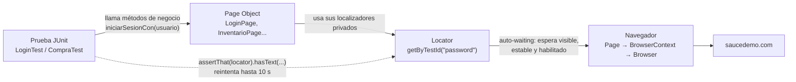

# Clase 4 · Playwright con Page Object Model (POM)

**Semillero QA 2026 · Módulo Automatización Web (QA Técnico)** · Rama `04-playwright-pom`
· Profesor: Diego Zapata — Equipo Transversal QS · [Volver al índice (`main`)](../../tree/main)

| Clase | Horario | Entrega de la actividad | Retroalimentación |
|---|---|---|---|
| Martes 29 de septiembre de 2026 | 9:00 a.m. – 12:00 m. (8:00–9:00 retro de la actividad 3) | **Jueves 1 de octubre de 2026, 8:00 a.m.** | Jueves 1 de octubre de 2026, 8:00 – 9:00 a.m. (y cierre del módulo 9:00–10:00) |

## Objetivo

Automatizar **los mismos flujos de las clases 2 y 3** sobre [saucedemo.com](https://www.saucedemo.com)
(login exitoso, login con usuario bloqueado y compra de un producto) usando **Playwright** y el
patrón **Page Object Model**, para comparar ese patrón con Screenplay y saber cuándo usar cada uno.

> **¿Por qué Playwright para Java y no TypeScript?** En la clase 1 aprendimos Java y POO. Usar
> Playwright para Java permite enfocarse en el framework y en el patrón sin cambiar de lenguaje.
> La API es prácticamente la misma en TypeScript, Python y .NET.

## Temas

- Frameworks de automatización (Playwright): Playwright, `Browser`, `BrowserContext`, `Page`, `Locator`.
- POM (Page Object Model): una clase por pantalla, localizadores privados, métodos de negocio.
- POO aplicada: herencia (`PaginaBase`), encapsulamiento (localizadores `private`), polimorfismo
  (`BrowserType` en `FabricaNavegador`) y composición (`EncabezadoComponent`).
- Aserciones *web-first* y *auto-waiting* (por qué no se necesita `Thread.sleep`).
- Ciclo de vida con JUnit, data driven con `@ParameterizedTest`, trazas y capturas en fallo.

## Requisitos

| Herramienta | Versión | Cómo comprobarlo |
|---|---|---|
| JDK | 17 o superior (probado con 21) | `java -version` |
| Maven | 3.9 o superior (probado con 3.9.16) | `mvn -v` |
| Conexión a internet | — | Para descargar dependencias, navegadores y abrir saucedemo.com |
| IDE | IntelliJ IDEA Community (recomendado) | — |

Versiones del proyecto: **Playwright para Java 1.63.0**, **JUnit 6.1.3** (motor Jupiter: la misma API
de JUnit 5 — `@Test`, `@BeforeEach`, `@ParameterizedTest`), Surefire 3.6.0, compilación para Java 17.

## Instalar los navegadores (una sola vez)

Playwright usa sus propios navegadores (no el Chrome de tu equipo). El proyecto **no los descarga
solo** al ejecutar las pruebas, para no bajar tres navegadores en redes lentas: instala únicamente
el que vas a usar.

```bash
# Chromium (el navegador por defecto del proyecto)
mvn exec:java -e -Dexec.mainClass=com.microsoft.playwright.CLI -Dexec.args="install chromium"

# Opcional: Firefox, para ejecutar con -Dnavegador=firefox
mvn exec:java -e -Dexec.mainClass=com.microsoft.playwright.CLI -Dexec.args="install firefox"
```

Quedan en `~/Library/Caches/ms-playwright` (macOS), `~/.cache/ms-playwright` (Linux) o
`%USERPROFILE%\AppData\Local\ms-playwright` (Windows).

> **Red corporativa con proxy que inspecciona HTTPS** (error `unable to get local issuer certificate`
> al instalar): en macOS/Linux ejecuta la instalación así para que use los certificados del sistema:
> `NODE_OPTIONS=--use-system-ca mvn exec:java -e -Dexec.mainClass=com.microsoft.playwright.CLI -Dexec.args="install chromium"`

## Cómo se ejecuta

| Qué quieres | Comando |
|---|---|
| Todas las pruebas (headless) | `mvn clean test` |
| Solo las de login (por tag) | `mvn clean test -Dgroups=login` |
| Solo las de compra (por tag) | `mvn clean test -Dgroups=compra` |
| Una clase de prueba | `mvn clean test -Dtest=CompraTest` |
| Un solo método | `mvn clean test -Dtest=LoginTest#loginExitoso` |
| **Ver el navegador en cámara lenta (para clase)** | `mvn clean test -Dheadless=false -DslowMo=500` |
| Con otro navegador | `mvn clean test -Dnavegador=firefox` |
| Guardar la traza de todas las pruebas, no solo las fallidas | `mvn clean test -DguardarTraza=siempre` |

Cualquier valor de [`src/test/resources/config.properties`](src/test/resources/config.properties)
(`baseUrl`, `headless`, `navegador`, `slowMo`, `timeoutMs`, `guardarTraza`) se puede cambiar con `-D`
sin editar el archivo. Por defecto `headless=true` para que funcione en integración continua.

Resultado esperado de `mvn clean test`:

```
[INFO] Tests run: 9, Failures: 0, Errors: 0, Skipped: 0 -- in Inicio de sesión en SauceDemo
[INFO] Tests run: 3, Failures: 0, Errors: 0, Skipped: 0 -- in Compra de productos en SauceDemo
[INFO] Tests run: 12, Failures: 0, Errors: 0, Skipped: 0
[INFO] BUILD SUCCESS
```

## Dónde quedan los resultados

| Qué | Dónde | Cuándo |
|---|---|---|
| Reporte de JUnit (XML y texto) | `target/surefire-reports/` | Siempre |
| Captura de pantalla (.png, página completa) | `target/capturas/` | Solo si la prueba falla |
| Traza de Playwright (.zip) | `target/trazas/` | Si la prueba falla (o siempre con `-DguardarTraza=siempre`) |

La consola imprime la ruta exacta: `Traza guardada: .../target/trazas/LoginTest_..._c5216830.zip`.

### Abrir una traza

La traza es la "caja negra" de la prueba: línea de tiempo con capturas, cada acción con el DOM
antes/después, el localizador usado, consola, red y el error.

```bash
mvn exec:java -e -Dexec.mainClass=com.microsoft.playwright.CLI -Dexec.args="show-trace target/trazas/NOMBRE_DEL_ARCHIVO.zip"
```

También puedes arrastrar el `.zip` a [trace.playwright.dev](https://trace.playwright.dev) (se procesa
en tu navegador). `target/` no se sube a Git.

## Cómo funciona



1. `BaseTest` abre Playwright y el navegador **una vez por clase** y crea un `BrowserContext`
   (sesión limpia, como incógnito) y una `Page` **por prueba**. Graba la traza de cada prueba.
2. La prueba crea `new LoginPage(pagina)` y encadena métodos: cada método devuelve la página a la
   que lleva (`iniciarSesionCon` → `InventarioPage` → `encabezado().irAlCarrito()` → `CarritoPage`…).
3. Las páginas definen sus `Locator` como atributos **privados**. La prueba nunca ve un selector.
4. Las validaciones usan `PlaywrightAssertions.assertThat(locator)`: **reintentan** hasta que se
   cumplen o vence `timeoutMs`.

### ¿Por qué no hay `Thread.sleep`?

- **Auto-waiting:** antes de `click()` o `fill()`, Playwright espera a que el elemento exista, sea
  visible, esté estable (sin animarse) y habilitado.
- **Aserciones web-first:** `assertThat(locator).hasText("Products")` vuelve a mirar la página
  hasta que el texto aparezca. Un `sleep` fijo es lento cuando la app es rápida y se queda corto
  cuando es lenta. Ejemplo real: `performance_glitch_user` tarda varios segundos en entrar y la prueba
  pasa sin esperas manuales.

## Arquitectura de carpetas

```
04-playwright-pom/
├── pom.xml                                   ← dependencias (Playwright, JUnit) y plugins (surefire, exec)
├── README.md
├── material-de-apoyo/                        ← guía, presentación y actividad de la clase 4
└── src/
    ├── main/java/co/com/semillero/playwright/
    │   ├── pages/                            ← PAGE OBJECTS: una clase por pantalla
    │   │   ├── PaginaBase.java               ← clase abstracta padre (HERENCIA): navegar, escribir, clic, esperar, texto
    │   │   ├── LoginPage.java                ← login: iniciarSesionCon / intentarIniciarSesionCon
    │   │   ├── InventarioPage.java           ← catálogo: agregarAlCarrito(nombre)
    │   │   ├── CarritoPage.java              ← carrito: productos e irAlCheckout
    │   │   └── CheckoutPage.java             ← datos de envío, total y finalizar compra
    │   ├── components/
    │   │   └── EncabezadoComponent.java      ← carrito y contador, reutilizado por varias páginas (COMPOSICIÓN)
    │   ├── models/
    │   │   ├── Usuario.java                  ← POJO: usuario y clave
    │   │   └── DatosDeEnvio.java             ← POJO: nombre, apellido, código postal
    │   └── utils/
    │       ├── Configuracion.java            ← lee config.properties y permite sobreescribir con -D
    │       └── FabricaNavegador.java         ← crea chromium/firefox/webkit (POLIMORFISMO con BrowserType)
    └── test/
        ├── java/co/com/semillero/playwright/tests/
        │   ├── BaseTest.java                 ← ciclo de vida JUnit, trazas y captura en fallo
        │   ├── LoginTest.java                ← @Tag("login"): 2 escenarios + data driven (@ValueSource, @CsvFileSource)
        │   └── CompraTest.java               ← @Tag("compra"): compra de un producto + data driven (@CsvSource)
        └── resources/
            ├── config.properties             ← baseUrl, headless, navegador, slowMo, timeoutMs, guardarTraza
            ├── junit-platform.properties     ← configuración global de JUnit (sin paralelismo)
            └── datos/login-invalido.csv      ← casos de login inválido con su mensaje esperado
```

Pruebas incluidas (12 ejecuciones):

| Clase | Prueba | Ejecuciones |
|---|---|---|
| `LoginTest` | Login exitoso con usuario estándar | 1 |
| `LoginTest` | Login con usuario bloqueado muestra mensaje de error | 1 |
| `LoginTest` | Login exitoso con distintos usuarios válidos (`@ValueSource`) | 3 |
| `LoginTest` | Login inválido muestra el mensaje correcto (`@CsvFileSource`) | 4 |
| `CompraTest` | Compra exitosa de un producto | 1 |
| `CompraTest` | Agregar dos productos al carrito (`@CsvSource`) | 2 |

## POM vs Screenplay

Mismo escenario: **login con usuario bloqueado**. Rama 02 (Screenplay) vs esta rama (POM).

| Responsabilidad | Screenplay (rama `02-screenplay-serenity-cucumber-web`) | POM (esta rama) |
|---|---|---|
| Describir el escenario | `login.feature` en Gherkin + `LoginStepDefinitions` | Método `loginConUsuarioBloqueado()` con `@DisplayName` en `LoginTest` |
| Dónde están los localizadores | `userinterfaces/PaginaDeLogin` (constantes `Target` públicas) | `pages/LoginPage` (atributos `Locator` privados) |
| Quién ejecuta las acciones | Un **actor** que realiza **tareas** (`tasks/IniciarSesion`) | La **página** (`loginPage.intentarIniciarSesionCon(usuario)`) |
| Cómo se valida | **Pregunta** (`questions/MensajeDeError`) + `seeThat(...)` | `assertThat(login.mensajeDeError()).hasText(...)` |
| Preparación y cierre | `Hooks` + Serenity | `BaseTest` (`@BeforeAll`, `@BeforeEach`, `@AfterEach`, `@AfterAll`) |
| Reporte | Reporte HTML de Serenity con pasos | Reporte de Surefire + capturas y trazas de Playwright |
| Cantidad de clases | Más clases pequeñas (tareas, preguntas, interacciones) | Menos clases: una por pantalla |
| Cuándo conviene | Suites grandes, muchos flujos que combinan acciones, negocio que lee Gherkin | Suites pequeñas o medianas, equipos que empiezan, pantallas estables |
| Riesgo típico | Sobre-ingeniería en proyectos pequeños | "Páginas Dios" con cientos de métodos cuando la suite crece |

No son enemigos: Screenplay puede verse como la evolución de POM cuando las páginas crecen demasiado.

## Selenium vs Playwright

| Tema | Selenium (clases 2 y 3, vía Serenity) | Playwright |
|---|---|---|
| Esperas | Explícitas o implícitas que configuras tú | Auto-waiting en acciones y aserciones |
| Navegadores | Usa el navegador instalado + driver | Descarga sus propios Chromium, Firefox y WebKit |
| Aislamiento | Normalmente un navegador por prueba | `BrowserContext` liviano por prueba |
| Depuración | Logs y capturas | Traza con línea de tiempo, DOM, red y consola |
| Lenguajes | Java, Python, C#, JS, Ruby… | Java, TypeScript/JS, Python, .NET |
| Madurez | Estándar W3C, ecosistema enorme (Grid, Appium) | Más reciente, API moderna, mantenida por Microsoft |

## Errores comunes

| Síntoma | Causa | Solución |
|---|---|---|
| `Executable doesn't exist at ...ms-playwright/...` | No se instaló el navegador | Ejecuta el comando de [instalación](#instalar-los-navegadores-una-sola-vez) para ese navegador |
| `unable to get local issuer certificate` al instalar | Proxy corporativo que inspecciona HTTPS | Instala con `NODE_OPTIONS=--use-system-ca` (ver arriba) |
| `strict mode violation: getByTestId("...") resolved to 6 elements` | El localizador encuentra varios elementos y Playwright no adivina cuál usar | Hazlo único: filtra por texto (`filter(new Locator.FilterOptions().setHasText(...))`) o busca dentro de un contenedor. Nos pasó al validar el carrito antes de que cargara: se resolvió esperando la página (`CarritoPage.esperarQueCargue()`) |
| La prueba se rompe cuando cambia el diseño | Localizadores frágiles (XPath largos, clases CSS, posiciones) | Prefiere `getByRole`, `getByText`, `getByPlaceholder` y `getByTestId` (`data-test`) |
| `Timeout 10000ms exceeded` | El elemento nunca apareció, o el localizador está mal | Abre la traza, revisa el localizador; no subas el timeout ni metas `Thread.sleep` |
| `No se encontró config.properties` | Se ejecutó sin los recursos de prueba | Ejecuta con Maven (`mvn test`) o desde el IDE con el módulo importado como Maven |

## Material de apoyo

- [Guía de estudio (Word)](material-de-apoyo/Clase4_Guia_Estudio_Playwright_POM.docx)
- [Presentación (PowerPoint)](material-de-apoyo/Clase4_Presentacion_Playwright_POM.pptx)
- [Actividad (Word)](material-de-apoyo/Clase4_Actividad_Playwright_POM.docx)
- Documentación oficial: [Playwright para Java](https://playwright.dev/java/docs/intro) ·
  [Page Object Models](https://playwright.dev/java/docs/pom) ·
  [Guía de usuario de JUnit](https://junit.org/junit5/docs/current/user-guide)

## Actividad

Extender este proyecto con nuevas páginas y flujos (ordenar productos, eliminar del carrito,
cerrar sesión y validaciones del checkout con `@ParameterizedTest`). El enunciado, la rúbrica y la
forma de entrega están en la [actividad](material-de-apoyo/Clase4_Actividad_Playwright_POM.docx).

**Entrega: jueves 1 de octubre de 2026, 8:00 a.m.** · Retroalimentación: jueves 1 de octubre de 2026,
8:00 – 9:00 a.m. (y cierre del módulo 9:00–10:00).
