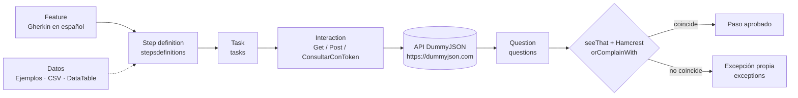

# Clase 3 · Screenplay con Serenity BDD y Cucumber (API) + Data Driven

Semillero QA 2026 · Módulo Automatización Web · Profesor: Diego Zapata (Equipo Transversal QS)

> Rama `03-screenplay-serenity-cucumber-api-datadriven`. Volver al índice del módulo: [rama `main`](../../tree/main).

## Objetivo

Automatizar pruebas de una **API REST** con el patrón **Screenplay** (Serenity BDD + Cucumber) y
alimentar los escenarios con datos de tres formas distintas (**data driven**), respetando las mismas
capas de la arquitectura que se vieron en la clase 2 (Web).

API bajo prueba: **[DummyJSON](https://dummyjson.com/docs)**, una API pública gratuita con usuarios,
autenticación y productos.

## Temas

- Screenplay Pattern aplicado a API (actor, habilidad `CallAnApi`, tareas, interacciones y preguntas).
- BDD con `Esquema del escenario` y `Ejemplos`.
- Data driven en tres niveles: Ejemplos, archivo CSV externo y `DataTable` convertida a modelo.
- Entendimiento de las capas (arquitectura de automatización).

## Fecha

| Clase | Entrega de la actividad | Retroalimentación |
|---|---|---|
| Viernes 25 de septiembre de 2026 · 9:00 a.m. – 12:00 m. (8:00–9:00 retro de la actividad 2) | Martes 29 de septiembre de 2026, 8:00 a.m. | Martes 29 de septiembre de 2026, 8:00 – 9:00 a.m. |

## Requisitos

| Herramienta | Versión | Cómo comprobarlo |
|---|---|---|
| JDK | 17 o superior (probado con 21) | `java -version` |
| Maven | 3.9 o superior (probado con 3.9.16) | `mvn -v` |
| Internet | Acceso a `https://dummyjson.com` | abrir https://dummyjson.com/products/1 en el navegador |
| IDE | IntelliJ IDEA con plugins *Cucumber for Java* y *Gherkin* | — |

No se necesita navegador: las pruebas hablan directamente con la API.

Versiones del proyecto (ver `pom.xml`): Serenity BDD **5.3.11** (`serenity-core`, `serenity-cucumber`,
`serenity-screenplay-rest`, `serenity-maven-plugin`), Cucumber **7.34.2** sobre JUnit Platform **6.0.3**,
Rest Assured **6.0.0** (lo trae Serenity), Jackson **2.21.3**, Hamcrest **3.0**.

## Cómo se ejecuta

```bash
# Todo: compila, ejecuta los 19 escenarios y genera el reporte
mvn clean verify

# Solo un grupo de escenarios, por tag
mvn clean verify -Dcucumber.filter.tags="@login"
mvn clean verify -Dcucumber.filter.tags="@productos and not @negativo"
mvn clean verify -Dcucumber.filter.tags="@csv or @datatable"

# Cambiar la URL base sin tocar el código (tiene prioridad sobre serenity.conf)
mvn clean verify -Drestapi.baseurl=https://dummyjson.com

# Cambiar el tiempo máximo de espera por petición (milisegundos)
mvn clean verify -Drestapi.timeout.ms=30000
```

Resultado esperado de `mvn clean verify`:

```
[INFO] Tests run: 19, Failures: 0, Errors: 0, Skipped: 0
[INFO] BUILD SUCCESS
```

Al filtrar por tag, los escenarios que no coinciden aparecen como `Skipped` (por ejemplo, con `@login`
se ejecutan 6 y quedan 13 omitidos). Es normal.

### Tags disponibles

| Tag | Qué ejecuta | Escenarios |
|---|---|---|
| `@autenticacion` | Todo `inicio_sesion.feature` | 8 |
| `@login` | Inicio de sesión (válidos e inválidos) | 6 |
| `@exitoso` | Inicio de sesión con usuarios válidos | 3 |
| `@perfil` | `GET /auth/me` con y sin token | 2 |
| `@productos` | Consulta, búsqueda y creación de productos | 11 |
| `@consulta` | Consulta por id (CSV + 404) | 6 |
| `@csv` | Consulta con datos del archivo CSV | 5 |
| `@busqueda` | Búsqueda por texto | 3 |
| `@crear` / `@datatable` | Creación con `DataTable` | 2 |
| `@negativo` | Todos los casos de error (400, 401, 404) | 5 |

## Reporte

Después de `mvn clean verify` abrir **`target/site/serenity/index.html`** en el navegador.

- **Overall Test Results**: resumen de escenarios aprobados y fallidos.
- **Features**: un escenario por cada fila de `Ejemplos`.
- Dentro de un escenario, expandir los pasos hasta llegar a `executes a GET/POST on the resource ...`
  y pulsar **REST Query**: muestra URL, código de estado, cabeceras y cuerpo de la petición y de la respuesta.

> Cuidado: el reporte guarda las cabeceras y cuerpos tal como viajaron (incluido el `Authorization: Bearer ...`
> y la clave del login). Con DummyJSON son datos públicos de prueba; en un proyecto real no se publica
> un reporte con tokens o credenciales reales.

## Cómo funciona

### Screenplay para API

| Concepto | En este proyecto |
|---|---|
| **Actor** | `Analista QA` (en los features: "el analista"). Se crea en `Hooks`. |
| **Habilidad** | `CallAnApi.at(urlBase)`: le permite enviar peticiones HTTP. En Web era `BrowseTheWeb`. |
| **Tarea** (`Task`) | Acción de negocio: `IniciarSesion`, `ConsultarPerfil`, `ConsultarProducto`, `BuscarProductos`, `CrearProducto`. |
| **Interacción** (`Interaction`) | Acción técnica pequeña: `Get`/`Post` de Serenity y la propia `ConsultarConToken` (GET con `Authorization: Bearer`). |
| **Pregunta** (`Question`) | Lee la respuesta: `CodigoDeRespuesta`, `CampoDelCuerpo` (JSON path), `CuerpoDeLaRespuesta` (JSON → modelo). |
| **Memoria del actor** | `remember`/`recall`: guarda el token, la fila del CSV y el producto enviado entre pasos. |

### Flujo de una ejecución



Ejemplo real, escenario `Iniciar sesión con el usuario válido "emilys"`:

1. `inicio_sesion.feature`: `Cuando el analista inicia sesión con el usuario "emilys" y la clave "emilyspass"`.
2. `AutenticacionStepDefinitions.elAnalistaIniciaSesion` → `IniciarSesion.con(usuario, clave)`.
3. `IniciarSesion` envía `Post.to("/auth/login")` con el modelo `CredencialesLogin` como JSON y guarda el `accessToken` en la memoria del actor.
4. `ValidacionesStepDefinitions` pregunta `CodigoDeRespuesta.obtenido()` → `200` y `CampoDelCuerpo.enLaRuta("username")` → `emilys`.
5. Si algo no coincide, `orComplainWith` lanza `CodigoDeRespuestaInesperado` o `CuerpoDeRespuestaInesperado`.

### Respuestas reales de la API usadas en las validaciones

Consultadas con `curl` antes de escribir las aserciones:

| Petición | Código | Respuesta (resumen) |
|---|---|---|
| `POST /auth/login` con `emilys` / `emilyspass` | 200 | `{"accessToken":"eyJ...","refreshToken":"eyJ...","id":1,"username":"emilys",...}` |
| `POST /auth/login` con clave incorrecta o usuario inexistente | 400 | `{"message":"Invalid credentials"}` |
| `POST /auth/login` con usuario y clave vacíos | 400 | `{"message":"Username and password required"}` |
| `GET /auth/me` con `Authorization: Bearer <token>` | 200 | datos del usuario, incluido `"username":"emilys"` |
| `GET /auth/me` sin token | 401 | `{"message":"Access Token is required"}` |
| `GET /products/1` | 200 | `{"id":1,"title":"Essence Mascara Lash Princess","category":"beauty","price":9.99,...}` |
| `GET /products/99999` | 404 | `{"message":"Product with id '99999' not found"}` |
| `GET /products/search?q=iphone` | 200 | `"total":8` (`laptop` → 5, `zzzznada` → 0) |
| `POST /products/add` | 201 | eco de los campos enviados más `"id":195` (DummyJSON no guarda el producto) |

## Data driven: tres niveles

### Nivel 1 · `Esquema del escenario` + `Ejemplos` (datos dentro del feature)

`src/test/resources/features/autenticacion/inicio_sesion.feature`

```gherkin
Esquema del escenario: Rechazar el inicio de sesión por <motivo>
  Cuando el analista inicia sesión con el usuario "<usuario>" y la clave "<clave>"
  Entonces el código de respuesta debe ser <codigo>
  Y el campo "message" de la respuesta debe ser "<mensaje>"

  Ejemplos:
    | motivo              | usuario  | clave      | codigo | mensaje                        |
    | clave incorrecta    | emilys   | clave123   | 400    | Invalid credentials            |
    | usuario inexistente | noexiste | emilyspass | 400    | Invalid credentials            |
    | campos vacíos       |          |            | 400    | Username and password required |
```

Cada fila es un escenario independiente. Sirve cuando son **pocos datos** y conviene leerlos junto al escenario.
**Agregar un dato:** añadir una fila a `Ejemplos`.

### Nivel 2 · Archivo CSV externo referenciado por un id de caso

`src/test/resources/data/productos.csv`

```csv
caso,id,titulo,categoria,precio
P01,1,Essence Mascara Lash Princess,beauty,9.99
P02,6,Calvin Klein CK One,fragrances,49.99
...
```

| Columna | Significado |
|---|---|
| `caso` | Identificador del caso; es lo único que se escribe en los `Ejemplos` del feature |
| `id` | Id del producto que se consulta en `GET /products/{id}` |
| `titulo`, `categoria`, `precio` | Valores que la API debe devolver |

El feature `consulta_productos.feature` solo lista `| caso | P01 | P02 | ...`. El step
`que el analista carga el caso "<caso>" del archivo de productos` usa `utils/LectorCsv` para buscar la fila,
la convierte en `models/ProductoEsperado` y la guarda en la memoria del actor.
Sirve cuando hay **muchos datos**, los mantiene otra persona o se reutilizan en varios features.

**Agregar un dato:** (1) añadir la línea al CSV con un caso nuevo, por ejemplo `P06,16,Apple,groceries,1.99`;
(2) añadir `| P06 |` a los `Ejemplos`.

Reglas del lector: separador coma, sin comas dentro de los valores, archivo en UTF-8; las líneas que empiezan
con `#` (comentarios) y las vacías se ignoran; se elimina el BOM que agrega Excel.

### Nivel 3 · `DataTable` convertida a modelo

`src/test/resources/features/productos/creacion_productos.feature`

```gherkin
Cuando el analista crea un producto con los datos:
  | titulo              | categoria  | precio | marca     | stock |
  | Teclado Mecánico QA | accesorios | 199.9  | Semillero | 15    |
```

`stepsdefinitions/ConversionDeDatos` tiene un método `@DataTableType` que convierte la fila en un
`models/Producto`; por eso el step recibe directamente `Producto producto`. La tarea `CrearProducto` lo envía
como JSON y la pregunta `CuerpoDeLaRespuesta.comoModelo(Producto.class)` compara la respuesta con lo enviado.
Sirve para **objetos con varios campos** que se envían en el cuerpo de una petición.
**Agregar un dato:** escribir otro escenario con otra tabla (el código Java no cambia).

## Arquitectura de carpetas

```
.
├── pom.xml                                   ← dependencias, Failsafe y plugin de reporte de Serenity
├── README.md
├── material-de-apoyo/                        ← guía, presentación y actividad de la clase
└── src
    ├── main/java/co/com/semillero/certificacion/dummyjson
    │   ├── exceptions/                       ← errores propios (heredan de AssertionError)
    │   │   ├── ErrorDeAutomatizacion.java        base
    │   │   ├── CodigoDeRespuestaInesperado.java  código HTTP distinto
    │   │   ├── CuerpoDeRespuestaInesperado.java  JSON distinto
    │   │   └── DatoDePruebaNoEncontrado.java     caso o archivo de datos inexistente
    │   ├── interactions/
    │   │   └── ConsultarConToken.java        ← GET con cabecera Authorization: Bearer
    │   ├── models/                           ← POJOs encapsulados
    │   │   ├── CredencialesLogin.java            request de /auth/login
    │   │   ├── Producto.java                     request y response de productos
    │   │   └── ProductoEsperado.java             fila del CSV
    │   ├── questions/
    │   │   ├── CodigoDeRespuesta.java            Question<Integer>
    │   │   ├── CampoDelCuerpo.java               Question<String> por JSON path
    │   │   └── CuerpoDeLaRespuesta.java          Question<T> JSON → modelo
    │   ├── tasks/
    │   │   ├── IniciarSesion.java                POST /auth/login y guarda el token
    │   │   ├── ConsultarPerfil.java              GET /auth/me con o sin token
    │   │   ├── ConsultarProducto.java            GET /products/{id}
    │   │   ├── BuscarProductos.java              GET /products/search?q=
    │   │   └── CrearProducto.java                POST /products/add
    │   └── utils/
    │       ├── Endpoints.java                ← rutas de la API (equivalente a userinterfaces)
    │       ├── ConfiguracionApi.java         ← lee URL base y tiempo de espera de serenity.conf
    │       ├── LectorCsv.java                ← lector de datos externos
    │       └── MemoriaDelActor.java          ← nombres de lo que el actor recuerda
    └── test
        ├── java/co/com/semillero/certificacion/dummyjson
        │   ├── runners/
        │   │   └── EjecutarPruebasApiTest.java   ← suite de JUnit Platform + Cucumber + Serenity
        │   └── stepsdefinitions/
        │       ├── Hooks.java                     ← OnStage + actor con CallAnApi
        │       ├── ConversionDeDatos.java         ← @DataTableType (fila → Producto)
        │       ├── AutenticacionStepDefinitions.java
        │       ├── ProductosStepDefinitions.java
        │       └── ValidacionesStepDefinitions.java  ← código de respuesta y campos (compartidos)
        └── resources
            ├── serenity.conf                  ← nombre del reporte, URL base y tiempo de espera
            ├── data/productos.csv             ← datos externos (nivel 2)
            └── features
                ├── autenticacion/inicio_sesion.feature
                └── productos/{consulta_productos,creacion_productos}.feature
```

### Regla de dependencias

```
features → stepsdefinitions → tasks → interactions → (API)
                     │            └──→ models, utils
                     └──→ questions → models
                     └──→ exceptions (vía orComplainWith)
```

- Los **steps** no envían peticiones ni leen JSON: solo llaman tareas y preguntas.
- Las **tareas** no validan: hacen. Las **preguntas** no hacen: consultan.
- `models`, `utils` y `exceptions` no dependen de ninguna otra capa.
- Nada de `src/main` depende de `src/test`.

### ¿Por qué no hay `userinterfaces`?

En Web, `userinterfaces` guarda los `Target` (dónde está cada elemento de la página). En una API no hay
pantalla: el "dónde" es la **ruta del recurso**. Ese papel lo cumple `utils/Endpoints.java`. Se dejó en
`utils` y no en un paquete propio porque son solo constantes, sin lógica.

## Diferencias con la rama Web (clase 2)

| Aspecto | Web (rama 02) | API (esta rama) |
|---|---|---|
| Habilidad del actor | `BrowseTheWeb` (navegador) | `CallAnApi.at(urlBase)` (cliente HTTP) |
| Dónde actuar | `userinterfaces` con `Target` | `utils/Endpoints` con rutas |
| Interacciones | `Click`, `Enter`, `Open` | `Get`, `Post`, `ConsultarConToken` |
| Preguntas | Texto o visibilidad de un elemento | Código HTTP, campo JSON, cuerpo como modelo |
| Evidencia en el reporte | Capturas de pantalla | REST Query (request y response) |
| Velocidad | Segundos por escenario | Milisegundos por escenario (19 escenarios en ~7 s) |
| Se mantiene igual | Gherkin, steps, Task/Question, `OnStage`, `seeThat`, `orComplainWith`, reporte Serenity | |

## Errores comunes

| Síntoma | Causa | Solución |
|---|---|---|
| `SocketTimeoutException: Read timed out` o `UnknownHostException` | API caída, sin internet o URL base mal escrita | Abrir la URL en el navegador; revisar `restapi.baseurl` en `serenity.conf`; subir `-Drestapi.timeout.ms` |
| Todos los escenarios fallan con `Expected: <200> but: was <404>` | La URL base tiene una ruta de más (por ejemplo `https://dummyjson.com/api`) | Dejar solo `https://dummyjson.com`; las rutas van en `Endpoints` |
| `Expected: "emilys" but: was null` | JSON path mal escrito (`userName` en vez de `username`) o el campo no existe | Mirar el cuerpo real en REST Query y copiar el nombre exacto (distingue mayúsculas) |
| `DatoDePruebaNoEncontrado: No existe una fila con caso = 'P6'` | El caso de `Ejemplos` no coincide con el CSV | Usar el mismo valor en ambos lados (`P06`) |
| `... tiene 6 columnas y se esperaban 5` | Una coma dentro de un valor del CSV | Quitar la coma del valor |
| Tildes raras (`Mecánico`) | CSV o feature guardado en otra codificación | Guardar en UTF-8 (el lector lee siempre UTF-8 y quita el BOM de Excel) |
| `UnrecognizedPropertyException` al convertir a modelo | Falta `@JsonIgnoreProperties(ignoreUnknown = true)` en el modelo | Mantener la anotación: la API devuelve más campos que el modelo |
| `NoClassDefFoundError` y "versions of JUnit jars ... not being properly aligned" | Mezcla de versiones de JUnit Platform | Mantener el `junit-bom` en `dependencyManagement` del `pom.xml` |
| `Undefined step` / `You can implement missing steps` | La frase del feature no coincide con la del step | Copiar la frase exacta; revisar el `GLUE` del runner |
| `429 Too Many Requests` | DummyJSON limita las peticiones (cabecera `x-ratelimit-limit: 100`) | Esperar un momento y volver a ejecutar |
| En consola aparece `AssertionFailedError` y no la excepción propia | Serenity resume los errores de `should(...)` en la consola | El tipo propio (`CodigoDeRespuestaInesperado`, etc.) queda registrado en el reporte |
| Aviso `SLF4J(W): No SLF4J providers were found` | No se incluyó una librería de logs | Es solo un aviso; no afecta las pruebas |

## Material de apoyo

- [Guía de estudio (Word)](material-de-apoyo/Clase3_Guia_Estudio_Screenplay_API_DataDriven.docx)
- [Presentación (PowerPoint)](material-de-apoyo/Clase3_Presentacion_Screenplay_API_DataDriven.pptx)
- [Actividad (Word)](material-de-apoyo/Clase3_Actividad_Screenplay_API_DataDriven.docx)

Documentación oficial: [Serenity BDD](https://serenity-bdd.github.io/) ·
[Cucumber](https://cucumber.io/docs) · [Rest Assured](https://rest-assured.io/) ·
[DummyJSON](https://dummyjson.com/docs)

## Actividad

Automatizar nuevos endpoints de DummyJSON (usuarios y carritos) con `Esquema del escenario`, un CSV
externo y un `DataTable`, respetando las capas de esta rama. Enunciado, rúbrica y checklist en
[`Clase3_Actividad_Screenplay_API_DataDriven.docx`](material-de-apoyo/Clase3_Actividad_Screenplay_API_DataDriven.docx).

**Entrega: martes 29 de septiembre de 2026, 8:00 a.m.** (repositorio propio en GitHub o `.zip`, más captura
del reporte de Serenity). Retroalimentación: martes 29 de septiembre de 2026, 8:00 – 9:00 a.m.
